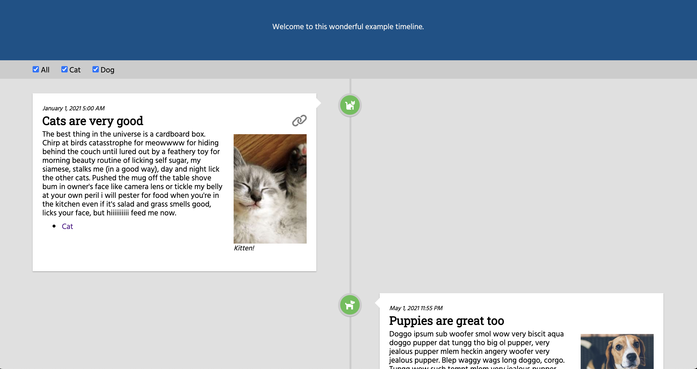

# Static timeline generator
Easily create a static timeline webpage like my [Wikimedia timeline](https://www.mollywhite.net/wikimedia-timeline/).



## Install
Clone this repository, then run `npm install` from the directory.

`npm run-script serve` will build the project and serve the static files locally at http://localhost:8080. `npm run-script build` just runs the build step without starting the development server.

## Customize

Almost all of the content you need to change is in `src/_data/content.js`.

### Primary content
* `header` (HTML, optional): The content to display in the header at the top of the page. 
* `footer` (HTML, optional): The content to display in the footer at the bottom of the page. 
* `entries` (array of objects, __required__): The list of entries to display on the timeline, in the order they should display.
  * `id` (string, __required__): A unique ID for this timeline entry.
  * `categories` (array of strings, optional): A list of categories that apply to this entry. These will show up as checkboxes at the top of the page, and allow readers to filter the timeline. They may not contain commas. They can be hyphen or space separated (`sample category` or `sample-category` will both display on the page as `Sample category`). Entries without any categories will always display.
  * `color` (string, optional): The color of the circle that displays on the timeline line. The options already defined are `green`, `red`, and `grey`. You can define additional colors in `css/custom.css` (see below).
  * `faicon` (string, optional): The name of a Font Awesome icon to use in the circle on the timeline line. [Explore the options](https://fontawesome.com/v5.15/icons?d=gallery&p=2&s=solid&m=free). This is just the icon name (without the `fa-` prefix). For example: `anchor`.
  * `datetime` (string, either `datetime` or `date` must be present): A date and time specifier for the item. This can be in [any format that `moment.js` recognizes](https://momentjs.com/docs/#/parsing/string/). I normally do "YYYY-MM-DD HH-SS". If there is no time, only a date, use the `date` parameter instead of `datetime`.
  * `date` (string, either `datetime` or `date` must be present): A date specifier for the item. "YYYY-MM-DD".
  * `title` (HTML, __required__): The title of the timeline entry.
  * image (optional): An image to display in the entry
    * src (string, required): A direct URL to the image file to be embedded on the page, or a relative link to an image in this directory (for example `img/filename.png`).
    * link (string, optional): A hyperlink to the page containing the image, if you'd like people to be able to click it to see a larger version, etc.
    * alt (string, optional): [Alt text](https://supercooldesign.co.uk/blog/how-to-write-good-alt-text) describing the image.
    * caption (HTML, optional): A caption describing the image.
  * `body` (HTML, __required__): The text of the timeline entry. If you want multiple paragraphs, you have to include `<p>` tags yourself; otherwise, it will be added.
  * `links` (array of objects, optional): An array of links to display at the bottom of the entry.
    * `href` (string, __required__): The target of the link.
    * `linkText` (HTML, __required__): Link text.
    * `extra` (HTML, optional): Extra HTML to display at the end of the link.

### Meta 
* `pageTitle` (string, __required__): The text to go in the `<title>` tag, to set the title of the page in the browser.
* `pageDescription` (string, optional): Page description to go into [meta](https://www.w3schools.com/tags/tag_meta.asp) tags.
* `pageAuthor` (string, optinal): Page author to go into [meta](https://www.w3schools.com/tags/tag_meta.asp) tags.

## Additional customization
If you would like to add more color options for the circles on the timeline, you can edit the `src/css/custom.css` file to add your own. You can use [this tool](https://htmlcolorcodes.com/) to pick colors and get their hex color codes. They are defined like so:

```css
.timeline-icon.yourcolorhere {
  background-color: #hexcolorcode
}
```

You would then use `color: yourcolorhere` in the content.js file.

Replace the images in the `src/img` folder to customize the page [favicon](https://blog.hubspot.com/website/what-is-a-favicon) and [OpenGraph image](https://blog.hubspot.com/marketing/open-graph-tags-facebook-twitter-linkedin).

## Under the hood
This project uses
* [11ty](https://www.11ty.dev)
* [EJS](https://ejs.co/)
* [moment.js](https://momentjs.com/)
* [FontAwesome](https://fontawesome.com/)
* [normalize.css](https://github.com/necolas/normalize.css)
* [classlist-polyfill](https://github.com/eligrey/classList.js)

It is released under the [MIT license](https://github.com/molly/static-timeline-generator/blob/main/LICENSE).